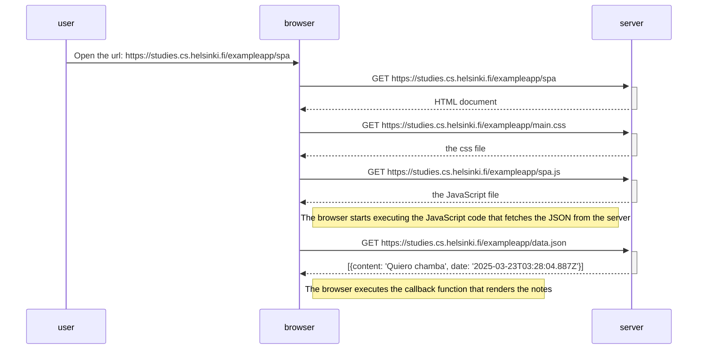

```mermaid
sequenceDiagram
    participant user
    participant browser
    participant server
    
    user->>browser: Open the url: https://studies.cs.helsinki.fi/exampleapp/spa
    activate server

    browser->>server: GET https://studies.cs.helsinki.fi/exampleapp/spa
    activate server
    server-->>browser: HTML document
    deactivate server

    browser->>server: GET https://studies.cs.helsinki.fi/exampleapp/main.css
    activate server
    server-->>browser: the css file
    deactivate server

    browser->>server: GET https://studies.cs.helsinki.fi/exampleapp/spa.js
    activate server
    server-->>browser: the JavaScript file
    deactivate server

    Note right of browser: The browser starts executing the JavaScript code that fetches the JSON from the server

    browser->>server: GET https://studies.cs.helsinki.fi/exampleapp/data.json
    activate server
    server-->>browser: [{content: 'Quiero chamba', date: '2025-03-23T03:28:04.887Z'}]
    deactivate server

    Note right of browser: The browser executes the callback function that renders the notes
```